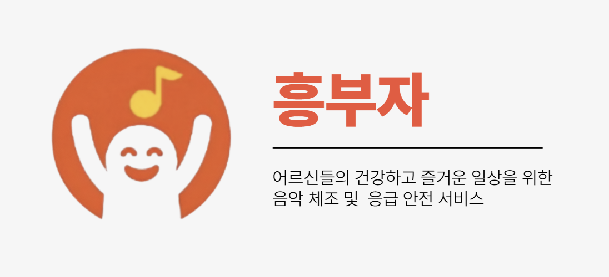

  

 

 

## 📖 프로젝트 개요

**음성인식 기반으로 어르신의 여가 생활을 보조하고 응급 상황에 대응하는 IoT 돌봄 시스템**

**기간** 2025.10 - 2025.11  
**인원** 6인

 

## 🚀 주요 기능

### 1. 음성 명령을 통한 주요 기능 제어
> "흥부야" 라는 호출어로 시스템을 활성화하고, 직관적인 음성 명령으로 모든 기능을 손쉽게 제어

-   **음악 재생**: "장윤정 어머나 틀어줘" 와 같이 가수와 노래 제목을 말하면 음악을 즉시 재생
-   **간편한 제어**: "그만 들을래" 등 간단한 명령으로 기능 정지

  

### 2. AI 동작 인식을 활용한 음악 체조 게임
> "체조할래" 음성 명령으로 시작되는 인터랙티브 건강 관리 콘텐츠
  
-   **실시간 동작 분석**: 카메라를 통해 사용자의 체조 동작을 실시간으로 인식하고 AI 모델로 정확도 분석
-   **동적 난이도 조절**: 사용자의 점수에 따라 다음 동작의 난이도가 자동으로 조절되어 흥미와 참여를 유도
  

  

### 3. 응급 상황 감지 및 신속 알림
> "살려줘" 와 같은 위급 상황을 암시하는 음성을 감지하여 신속하게 대응

-   **응급 호출**: 특정 키워드 감지 시, 사전에 등록된 관리자에게 SMS 또는 앱 알림을 자동으로 발송
-   **이력 관리**: 관리자 대시보드에서 응급 상황 발생 이력을 조회하고 관리
  

  

 

## 🏛️ 시스템 아키텍처

**실시간 반응성**과 **안정적인 데이터 관리**를 위해 두 개의 독립적인 시스템으로 구성된 하이브리드 아키텍처 채택

  

### 1. 사용자 단말 시스템 (Raspberry Pi)
> **높은 접근성**을 위해 자동 로그인을 처리하고, Wake Word 감지

-   **`Raspberry Pi`**: 접근성을 높이기 위해, 어르신의 음성 명령으로 전원이 들어오고, 전원이 들어옴과 동시에 기기번호로 자동 로그인

  
### 2. 웹 기반 관리 시스템 (Spring Boot + AWS)
> 관리자가 사용자와 기기를 관리하고, 서비스 이용 데이터를 모니터링하기 위한 **안정적이고 확장 가능한 서버 환경**을 구축하고 AWS에 배포

-   **`Spring Boot`**: 사용자 및 기기 관리, 서비스 이용 데이터 분석, 응급 알림 발송 등 핵심 비즈니스 로직과 API를 담당
-   **`MySQL`**: 사용자 정보, 서비스 이용 기록, 응급 호출 데이터 등을 저장 및 관리
-   **`Mongo DB`**: 노래의 박자 정보, 가사, 동작 정보를 저장 및 관리

 

## 🛠️ 기술 스택 

| 구분                | 기술                                                                     |
| :------------------ | :----------------------------------------------------------------------- |
| **Frontend**        | `React`, `Vite`, `React Router`     |
| **Backend**      | `Spring Boot`, `Java 17`, `Spring Security`, `JWT`, `JPA`                                |
| **AI / VUI**         | `Python`, `OpenCV`, `MediaPipe`, `Picovoice`, `GPT`                   |
| **Database**        | `MySQL`, `Redis`, `Mongo DB`                                                                  |
| **Embedded / IoT**  | `Raspberry Pi 4`          |
| **Infra**           | `AWS`, `Docker`, `Nginx`                                                   |

 

## 👨‍💻 팀원 (Team 흥마법사)

| 이름     | 역할              |
| :------- | :---------------- | 
| **이지민** | **팀장, Backend, AI**  | 
| **김선민**   | **Frontend**        |
| **박재은** | **Frontend**        |
| **윤현석** | **Backend, AI**    |
| **이영우** | **Infra**      |
| **장수연 (본인)** | **Backend, Embedded**     |
